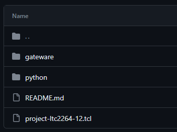
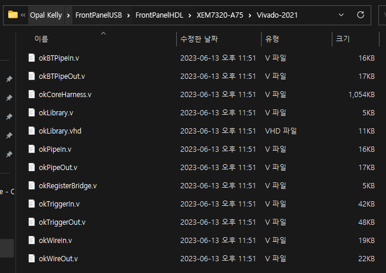
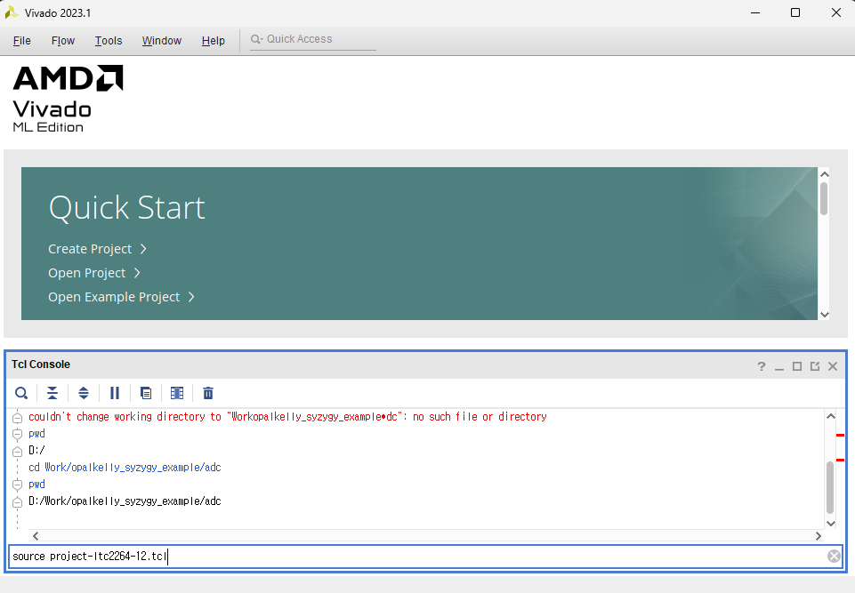
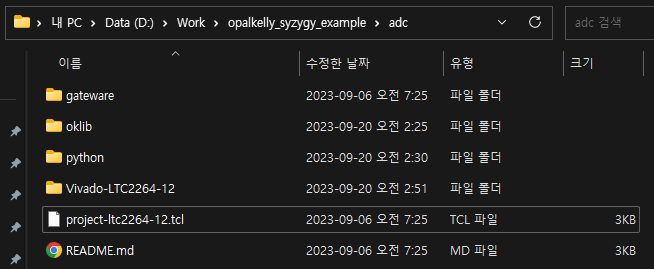
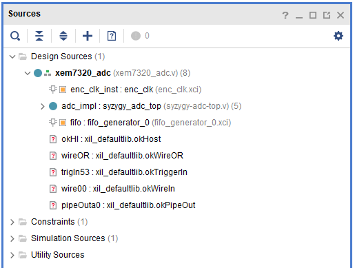
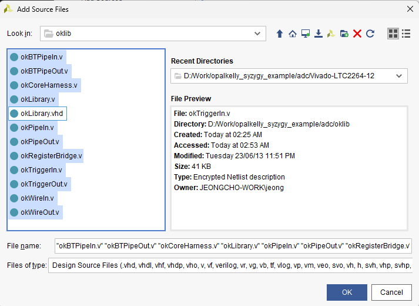
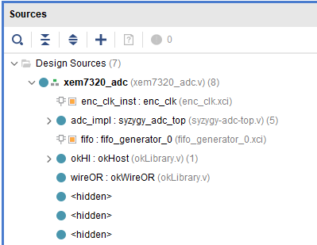
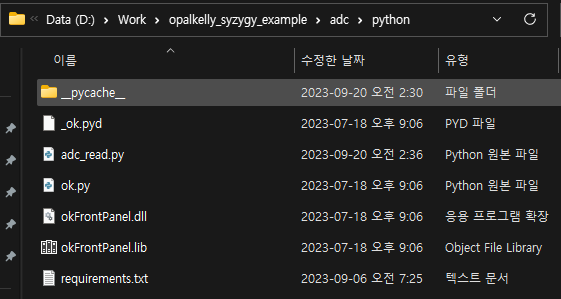
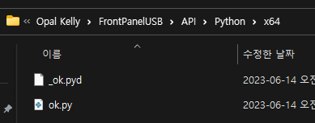
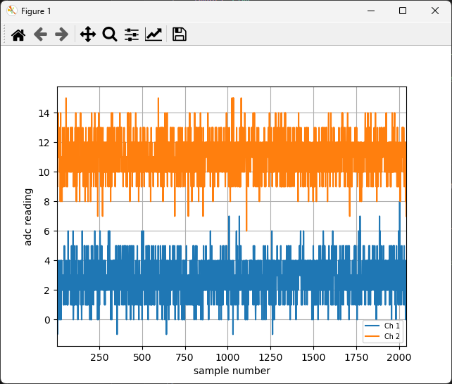

# Opalkelly SYGYGY Examples

## 1. [ADC Sample](https://github.com/opalkelly-opensource/design-resources/tree/main/ExampleProjects/ADC_Sample)

- 위에 링크한 github에서 파일을 다운로드 한다.

- opalkelly driver는 설치되어 있어야 한다. [Download](https://pins.opalkelly.com/downloads)

- Dirver가 설치된 경로에서 HDL library를 복사한다.

- Vivado 실행 후 project-ltc2264-12.tcl 파일을 실행한다.

- Vivado project가 생성 될 것이다.

- Project에는 HDL library가 포함되어 있지 않기 때문에 복사해둔 HDL 파일을 불러온다.

- compile 해서 bit 파일을 생성한다.

- python 폴더 아래에 API를 복사한다. API는 driver 가 설치된 곳에 있다.

- python 파일을 실행하면 아래와 같이 ADC 값을 확인 할 수 있다.

## 2. [DAC Sample](https://github.com/opalkelly-opensource/design-resources/tree/main/ExampleProjects/DAC_Sample)

- 위에서 생성한 ADC project를 참고 하여 DAC 용 project를 생성한다.

- HDL 파일과 xdc 를 이용하여 bit 파일을 생성한다.

